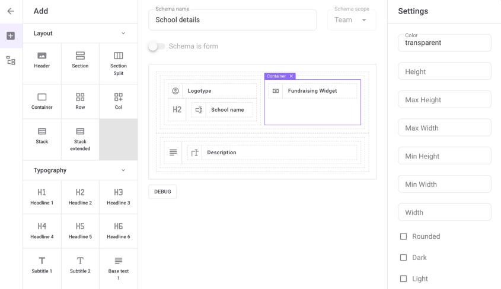

# Layout builder

Consists of:
- Blocks selector
- Layout info (name, scope, type)
- Layout schema
- Block Settings

Layout type is selected with *Schema is form* switch. Layout with type `form` allows to build a schema for creating/editing an entity (attribute components only with `set` type are used). Layout with type `details` represents a schema for entity information display (attribute components only with `read` type are used).

Uses **VlsBuilder** from `@casimir/vue-layout-schema`.